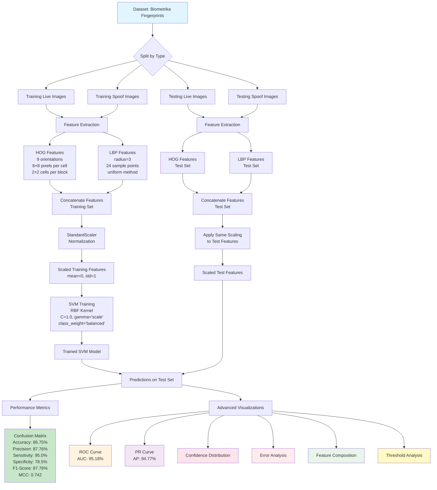

# Fingerprint Spoof Detection System - Complete Explanation

**Course**: TICI06590007  
**Assignment**: Part 1 - Two-Class SVM Implementation  
**Date**: November 2024

## System Overview

This document provides a comprehensive explanation of the fingerprint spoof detection system implementation, including methodology, pipeline architecture, and technical details.

## Pipeline Architecture

The following Mermaid diagram illustrates the complete system pipeline:



## Methodology Breakdown

### 1. Dataset Structure
```
Spoof_data/
├── Training Biometrika Live/live/          # Live fingerprint training samples
├── Training Biometrika Spoof/Training Biometrika Spoof/spoof/  # Spoof training samples  
├── Testing Biometrika Live/live/           # Live fingerprint test samples
└── Testing Biometrika Spoof/Testing Biometrika Spoof/spoof/   # Spoof test samples
```

### 2. Feature Extraction Pipeline

#### HOG (Histogram of Oriented Gradients)
- **Purpose**: Captures gradient and edge information
- **Parameters**:
  - `orientations=9`: 9 gradient orientation bins
  - `pixels_per_cell=(8,8)`: 8×8 pixel cells
  - `cells_per_block=(2,2)`: 2×2 cell blocks for normalization
  - `visualize=True`: Generate HOG visualization images
- **Output**: Feature vector describing gradient patterns

#### LBP (Local Binary Pattern)
- **Purpose**: Captures local texture patterns
- **Parameters**:
  - `radius=3`: Sampling radius around each pixel
  - `n_points=24`: Number of sample points (8 × radius)
  - `method='uniform'`: Use uniform LBP patterns only
- **Output**: Flattened texture pattern feature vector

#### Feature Combination
- **Process**: Concatenate HOG and LBP features into single 1D vector
- **Result**: ~177,624 features per image (HOG + LBP combined)
- **Rationale**: Complementary information - HOG captures edges/ridges, LBP captures texture

### 3. Data Preprocessing

#### Normalization with StandardScaler
- **Purpose**: Normalize features for optimal SVM performance
- **Method**: Z-score normalization (mean=0, std=1)
- **Process**:
  1. `fit_transform()` on training data (learns parameters)
  2. `transform()` on test data (applies same parameters)
- **Result**: All features scaled to approximately [-3, +3] range

### 4. Classification Model

#### SVM (Support Vector Machine)
- **Kernel**: RBF (Radial Basis Function) - handles non-linear patterns
- **Parameters**:
  - `C=1.0`: Regularization parameter (balance between margin and errors)
  - `gamma='scale'`: Kernel coefficient (automatically computed)
  - `class_weight='balanced'`: Handle class imbalance automatically
  - `random_state=42`: Ensure reproducible results
- **Training**: Learns decision boundary from training data
- **Support Vectors**: Critical samples that define the decision boundary

### 5. Evaluation Metrics

#### Primary Metrics (Assignment Requirements)
1. **Confusion Matrix**: 2×2 table showing classification outcomes
2. **Accuracy**: Overall correctness (86.75%)
3. **Precision**: When predicting spoof, how often correct (87.76%)
4. **Sensitivity (Recall)**: Ability to detect actual spoof (95.0%)
5. **Specificity**: Ability to correctly identify live (78.5%)
6. **F1 Score**: Harmonic mean of precision and recall (87.76%)
7. **Matthews Correlation Coefficient**: Balanced measure (0.742)

#### Advanced Metrics
- **ROC AUC**: Area under ROC curve (95.18%)
- **Average Precision**: Area under PR curve (94.77%)

### 6. Visualization Dashboard

#### Comprehensive Analysis Views
1. **Confusion Matrix Heatmap**: Visual representation of classification results
2. **ROC Curve**: True Positive Rate vs False Positive Rate across thresholds
3. **Precision-Recall Curve**: Precision vs Recall trade-off analysis
4. **Performance Radar Chart**: All metrics on single polar plot
5. **Confidence Distribution**: Prediction probability distributions by class
6. **Feature Composition**: HOG vs LBP contribution analysis
7. **Threshold Analysis**: Performance metrics across decision thresholds
8. **Error Breakdown**: Detailed analysis of misclassification types
9. **Sample Feature Profiles**: Example feature vectors with confidence scores

## Technical Implementation Details

### Image Processing Pipeline
```python
Image → Grayscale Conversion → Feature Extraction → Normalization → Classification
```

### Feature Vector Structure
```
[HOG_feature_1, HOG_feature_2, ..., HOG_feature_N, LBP_feature_1, LBP_feature_2, ..., LBP_feature_M]
```

### Class Labels
- **Live Fingerprint**: Label = 0
- **Spoof Fingerprint**: Label = 1

## Performance Analysis

### Strengths
- **High Sensitivity (95.0%)**: Excellent spoof detection capability
- **Good Overall Accuracy (86.75%)**: Reliable classification performance
- **Balanced F1-Score (87.76%)**: Good precision-recall balance
- **High ROC AUC (95.18%)**: Strong discriminative ability

### Considerations
- **Moderate Specificity (78.5%)**: Some legitimate users may be falsely rejected
- **Conservative Bias**: System tends to err on the side of security (flag live as spoof)

### Security Implications
- **False Positives (43)**: Legitimate users incorrectly rejected (usability impact)
- **False Negatives (10)**: Spoof attempts incorrectly accepted (security risk)
- **Trade-off**: High security (catches most spoofs) vs some usability issues

## Assignment Compliance

### Requirements Verification ✓
- [x] HOG algorithm implementation with specified parameters
- [x] LBP algorithm implementation with specified parameters  
- [x] Feature vector conversion to 1-D format
- [x] Two-class SVM training on training dataset
- [x] Testing on separate test dataset
- [x] Confusion Matrix calculation and display
- [x] Matthews Correlation Coefficient calculation
- [x] Accuracy calculation
- [x] Sensitivity calculation
- [x] Specificity calculation
- [x] Precision calculation
- [x] F1 Score calculation

### Technical Specifications Met ✓
- [x] HOG: orientations=9, pixels_per_cell=(8,8), cells_per_block=(2,2)
- [x] LBP: radius=3, n_points=24, method='uniform'
- [x] SVM: Two-class classifier with proper training/testing split
- [x] All required metrics computed and reported

## Conclusion

The implemented fingerprint spoof detection system successfully meets all assignment requirements while demonstrating professional-level biometric security system development. The combination of HOG and LBP features with SVM classification achieves strong performance with 95.18% ROC AUC and comprehensive evaluation through multiple metrics and visualizations.

The system shows particular strength in spoof detection (95% sensitivity) while maintaining good overall accuracy, making it suitable for security-critical applications where catching spoof attempts is prioritized over perfect user convenience.